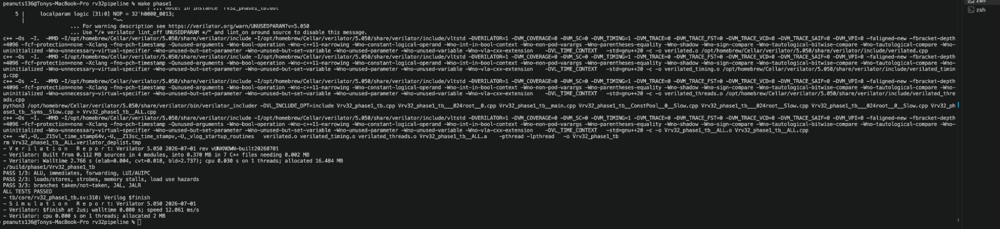
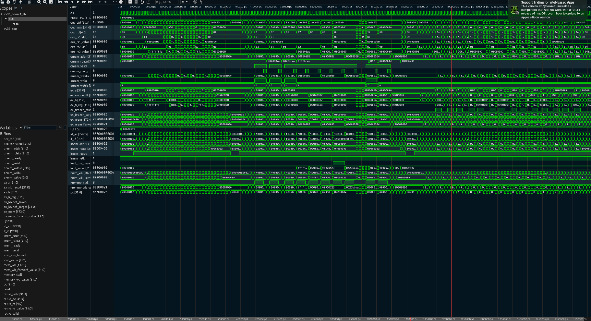
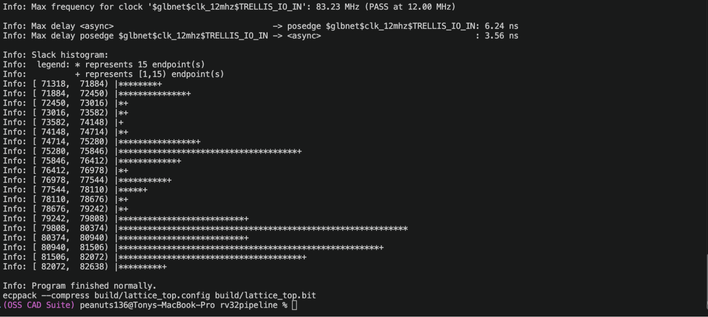
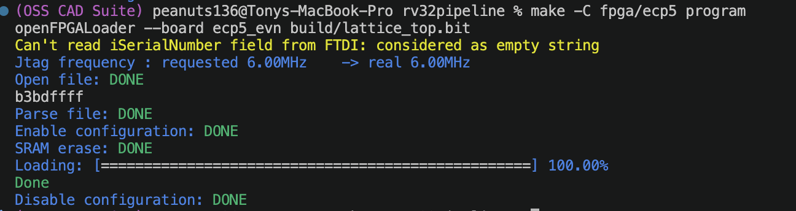

# RV32 Processor with FPGA Verification

This design has been a passion project of mine. It includes a single issue, in-order, 32 bit RISC-V processor written in SystemVerilog. Major design ideas include a classic processor pipeline visible with RTL (register transfer level): 5 Stages, pipeline registers, forwarding, hazard detection, control flows, unified memory with instruction and data memory stored as RAM, and architectural writebacks. 

The core is verified with Verilator simulations and FPGA systems containing memory mapped RAM and GPIO. The current hardware utilizes the Lattice ECP5 Evaluation Board (LFE5UM5G-85F-8BG381). 

Function is demonstrated with traces (Surfer or gtkwave). A RISC-V program was stored in the FPGA's RAM which writes to a GPIO register that controls an onboard LED.

## Processor architecture
The processor follows a classic five stage RISC pipeline.
```text
PC → IF → IF/ID → ID → ID/EX → EX → EX/MEM → MEM → MEM/WB → WB
```
Only 1 instruction is fetched per cycle, and instruction will maintain order upon committment. Several instructions can be in the pipeline at the same time because of the pipelined architecture.
## Instruction Fetch (IF)
The fetch stage presents the program counter (PC) on the instruction memory port. When memory asserts imem_ready = 1, a 32 bit instruction will be retrieved (alongside its PC) an enters IF/ID, and the current PC advances by four bytes.

The default next PC is considered to be PC + 4 (due to 32 bit instruction sizes). This of course will be changed in the event of a taken branch or jump which is resolved in EX. The jump/branch will then invalidate any younger instruction that is on the wrong path.

## Instruction Decode (ID)
Decode extracts: rs1, rs2, rd, funct3, funct7, opcode, and the sign extended immediate. Upon decoding, it will emit control signals such as ALU_ADD, BR_LT, etc. 

Register x0 is forced to binary 0. In the case that the current decoded instruction requires a register value currently being utilized in the writeback stage, a WB to ID bypass function is included. This will allow the newer instruction to immediately use the register value on the same clock edge instead of waiting for the register to be updated. 
## Execute (EX)
EX contains the ALU, operand selection (e.g rs2 v.s immediate), forwarding selection (whether an operand further in the pipeline can be used), branch comparison, and jump target calculation. It supports arithmetic operations, logical comparisons, bitwise shifts, and address calcuations. 

## Memory Access (MEM)
Load and stores uses a valid to ready memory interface. Byte strobes properly select the lanes for different operations (SB, SH, SW all send different amounts of bytes). Load data is shifted accordingly for sign/zero extended loads. 

In the case a request is not ready, the core will hold the pipeline in place.
## Writeback (WB)
Writeback selects the architectural result:
* WB_ALU: ALU result
* WB_MEM: loaded memory value
* WB_PC4: return address for JAL or JALR instructions

It writes rd when reg_write = 1 and rd != x0. It also emits retirement (for debugging) trace with instruction, PC, destination register, and written value. 
## Pipeline hazards

### Data forwarding
Most RAW (Read After Write) dependencies can be handled without stalling. EX can select a newer result, if exists, from EX/MEM or MEM/WB instead of the older value carried in the current register file. EX/MEM would have highest priority because it should contain the newest register value.

```asm
add  x3, x1, x2
sub  x4, x3, x5    #x3 is forwarded to EX
```
### Load Use Interlock
In the case a load result is not available early enough for the instruction's EX stage, the hazard detector will insert one bubble/NOP while holding the states.
```asm
lw   x4, 0(x1)
add  x5, x4, x2    #One forced bubble, then MEM/WB forwarding
```
### Control Hazards
The core fetches sequentially and currently does not support branch predictions. A taken branch or jump resolved in EX will redirect the PC and flush younger instructions in IF and ID. This is simpler than using speculation but is basically forced to always lose work performed on the wrong path. 
## Supported Instructions
| Group | Instructions |
| --- | --- |
| Register ALU | `ADD`, `SUB`, `SLL`, `SLT`, `SLTU`, `XOR`, `SRL`, `SRA`, `OR`, `AND` |
| Immediate ALU | `ADDI`, `SLLI`, `SLTI`, `SLTIU`, `XORI`, `SRLI`, `SRAI`, `ORI`, `ANDI` |
| Loads | `LB`, `LH`, `LW`, `LBU`, `LHU` |
| Stores | `SB`, `SH`, `SW` |
| Branches | `BEQ`, `BNE`, `BLT`, `BGE`, `BLTU`, `BGEU` |
| Control transfer | `JAL`, `JALR` |
| Upper immediates | `LUI`, `AUIPC` |

The current design lacks exceptions, interrupts, ECALL, multiplication, division, atomics, and floating point operations. Illegal instructions are simply discarded instead of raising exceptions. The current core iteration cannot be considered a fully general purpose RISC-V platform. 
## Design Decisions and tradeoffs

### In Order Single Issue 

In order execution makes dependencies, commitments, and verification manageable while still allowing for instruction overlap via pipelining. It avoids the usage of register renamings and reorder buffers needed for out of order processor designs. The tradeoff is stalled older instructions will prevent independent younger instructions from moving. 

MIT's 6.5900 L6-7 provides basic design principles for dynamic scheduling and out of order execution for instructions that are independent, meaning that their registers do not depend on an older instructions' registers. This design would be the next step, at the cost increasing states, control signals, and verification. 

### Forward where possible and stall if necessary

Forwarding adds muxes to the EX path, providing unnecssary stalls for most RAW dependencies. This design will not work for load use hazards because memory has not produced the value to forward.

### Separate instruction and data ports

The core uses independent instruction and data ports so fetch and load/stores can be utilized concurrently. The split will allow for separate instruction and data cache designs.

### Valid/ready memory

The core does not assume memory accesses finishes immediately, for example a SSD read would take dramatically more time than a cache hit. This requires the pipeline state to remain stable during waits without requiring an artificial RAM latency and allow for future cache hit/misses and GPIO peripherals for example. 

### Integrated core implementation

The main stages: decode, ALU, hazard, forwarding, and pipelining are handled directly in the rv32_core.sv file. This makes the signal inspection easy to inspect. Separating those into modules would improve reuse and scalability as design grows but would not meaningfully change the architecture itself. 

### No caching yet

The FPGA uses embedded block RAM, which is a hardware component stored on the FPGA and can return data with the clock edge. Since the processor is currently connected to the block RAM, adding cache would not provide practical speedup. 

A cache design would be useful when the main memory RAM is much slower than the pipeline. A possible design would include:

- a small cache between CPU and memory
- a slower memory model that takes more cycles to respond

Performance counters could record cache hit rates, misses, penalty time, etc. This could then be compared with other designs using AMAT (average memory access time) = hit time + (miss rate * miss penalty). This would then allow for the observation of the 3 common cache misses: compulsory, capacity, and conflict. 

### Core Interface
The rv_32 core itself contains no board pins or peripherals. The board integration is handled via the Silicon On Chip wrapper, connecting the core to the block RAM and decoder (handling the 0x1000_0000 memory location as one GPIO register).

### Verification 

The testbenches tests for ALU operation, decodings, forwarding, bypassing, load/store byte lanes, load use stalls, forced memory waits, branching, flushing, jumps, amongst other important functionalities. 

The self checking testbench verifies the supported instructions, forwarding, load use, memory stalls, and control flow. 


*All three Phase 1 test groups completed successfully.*

The waveform can be opened via Surfer, with register values, PC, control signals, hazards, etc to be examined over time. 

The generated VCD trace allows internal pipeline state, forwarding paths,
hazards, memory requests, and retirement behavior to be inspected.



*Pipeline simulation viewed in Surfer.*
## FPGA Demo

The hardware is the Lattice ECP5 Evaluation Board. OSS CAD Suite was utilized for synthesis, placement, routing, generating bitstreams, and overall board configuration.

The current assembly program is linked to address zero, converted to $readmemh hexadecimal and embedded in the FPGA's block RAM during synthesis. The CPU obtains the _start point of the program, writing inverse values to GPIO with delays, ultimately flipping one of the built in LEDs. 

The design uses an 12MHz clock


*nextpnr reports an estimated maximum clock frequency of 83MHz, over the required 12MHz we set*



*openFPGALoader successfully loaded the generated bitstream into the FPGA’s RAM.*

The processor executes a RISC-V assembly program into the FPGA's block RAM. The program repeatedly writes 1s and 0s to the memory mapped GPIO register, causing an onboard LED to blink. 
[](docs/videos/fpga-led-blink.mp4)

*Click the animation to open the full demonstration video.*

## Layout
```text
rtl/core/   processor and pipeline definitions
tb/core/    directed core testbench
rtl/system/ RAM, decoder, GPIO, and SoC wrapper
rtl/fpga/   reset conditioning and board top level
tb/soc/     program/GPIO simulation
tests/      assembly, linker script, and memory images
fpga/ecp5/  constraints and FPGA build flow
```
## Next steps
1. Add performance counters such as CPI
2. Add branch prediction and compare the CPI for misdirection
3. Add direct mapped or hashed mapped cache alongside slower main memory and measure AMAT
4. Add exceptions
5. Refactor code into independent modules

## Requirements and Usage
Run the following commands from the repository root

### Important Required Tools
| Tool | Purpose | Required for |
| --- | --- | --- |
| GNU Make | Runs the project build recipes | All workflows |
| Verilator | SystemVerilog linting and simulation | Core and SoC verification |
| A waveform viewer such as Surfer or gtkwave | Opens generated VCD traces | Optional waveform inspection |
| OSS CAD Suite | Contains libraries for running FPGA | FPGA Build | 

On macOS, use Homebrew for installing Verilator

```sh
brew install verilator
```
The FPGA tools contains the libraries for running the FPGA
[OSS CAD Suite](https://github.com/YosysHQ/oss-cad-suite-build). After extracting, activate the environment.

```sh
source /path/to/oss-cad-suite/environment
```

If the launch scripts do not locate their corresponding executables on macOS, place both directories on `PATH`, with `libexec` first:

```sh
export PATH="/path/to/oss-cad-suite/libexec:/path/to/oss-cad-suite/bin:$PATH"
rehash
```
Confirm libraries were installed: 

```sh
verilator --version
yosys -V
yosys -p 'help read_slang'
nextpnr-ecp5 --version
ecppack --help
openFPGALoader --version
```
### Clone the repository

```sh
git clone https://github.com/YOUR_USERNAME/rv32-pipeline.git
cd rv32-pipeline
```
Replace with your username.

### Lint and test the processor

```sh
make clean
make lint
make test
```

A successful run should end with the testbench's PASS "message". This test tests essential functionality of the processor.

### Generate and view a core waveform

```sh
make waves
surfer build/core/rv32_core.vcd
```
### Test the complete SoC

The phase 3 simulation is a comprehensive test of the processor with all of the functionalities. 

```sh
make -f Makefile.phase3 phase3_lint
make -f Makefile.phase3 phase3_sim
```
Generate and view the SoC waveform.

```sh
make -f Makefile.phase3 phase3_waves
surfer build/phase3_sim/cpu_soc.vcd
```
### Rebuild the LED program

The repository includes generated images, so this step is unnecessary unless
`tests/asm/blink.S` changes:

```sh
bash scripts/build_blink.sh
```

The script assembles and links the program, then creates:

- `blink.elf`: linked executable with symbols;
- `blink.bin`: raw machine-code bytes;
- `blink.dis`: human-readable disassembly;
- `blink.hex`: words consumed by `$readmemh` for FPGA RAM initialization.

### Build the ECP5 bitstream

Activate the OSS CAD Suite environment via above commands or their given repository's commands and then run:

```sh
make -C fpga/ecp5 clean
make -C fpga/ecp5
```
### Program the evaluation board

Before programming:

1. Connect the board's power cable and then the programming USB to computer
2. The board should come with a jumper on JP2, make sure that is properly installed. Remove jumper on JP1

Load the bitstream into volatile FPGA RAM.

```sh
make -C fpga/ecp5 program
```

This configuration is volatile, meaning it will disappear after power off. To write the program permanently on SPI flash:
```sh
make -C fpga/ecp5 flash
```

Use the flash target only after the volatile program has been successfully tested. LED0 should blink according to the GPIO programming. 

## References

- [MIT 6.5900/6.823 Computer System Architecture lecture notes](https://csg.csail.mit.edu/6.5900F23/lecnotes.html) — L02–L03 for caches and memory hierarchy, L05 for pipeline timing and hazards, L06–L07 for complex pipelines, and L08 for branch prediction.
- [MIT 6.5900 tutorials](https://csg.csail.mit.edu/6.5900/recitations.html) — includes simple instruction pipelining designs. 
- [RISC-V Unprivileged ISA Specification, Volume I](https://docs.riscv.org/reference/isa/unpriv/unpriv-index.html) — essential RISC-V ISA architectural behavior. 
- [RV32I Base Integer Instruction Set](https://docs.riscv.org/reference/isa/v20240411/unpriv/rv32.html) — focused description of ISA elements, e.g encodings. 
- [Lattice ECP5 Evaluation Board User Guide](https://www.latticesemi.com/en/Products/DevelopmentBoardsAndKits/ECP5EvaluationBoard) — device, clocks, controls, LEDs, and pin assignments.

